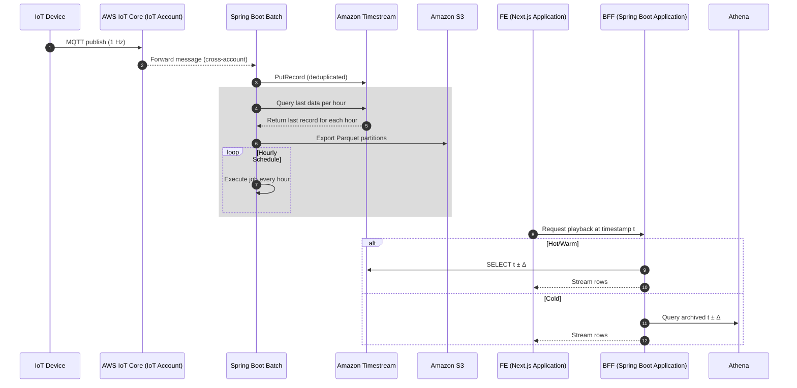


# AWS IoT Playback Data Workflow Update

This document describes the updated data flow and workflow for AWS IoT playback data. It includes the rationale for the update, a comparison with the previous design, and the new data flow and workflow definitions.
  
## Rationale for Update

**Cause:**
-	The previous design planned to use Amazon Timestream for storing and querying playback data, with Amazon Timestream for LiveAnalytics as the query engine. During development, AWS announced that LiveAnalytics is no longer available for new customers and recommends Amazon Timestream for InfluxDB as the alternative.

**Impact:**
-	The workflow depending on LiveAnalytics is no longer valid. Several data flows and functions require redesign.

**Resolution:**
-  The workflow has been revised to replace LiveAnalytics with Timestream for InfluxDB, ensuring service compatibility and supporting time-series data storage

### Comparison: Amazon Timestream for LiveAnalytics vs InfluxDB

| Criterion              | Amazon Timestream for LiveAnalytics                               | Amazon Timestream for InfluxDB                                   |
|------------------------|-------------------------------------------------------------------|------------------------------------------------------------------|
| **Service Availability** | Discontinued for new customers                                   | Available and AWS-recommended                                |
| **Storage Tiering**      | Two-tier: in-memory + magnetic                          | Single-tier, retention defined by user |
| **Retention **      | User defines per-tier(in-memory, magnetic); data auto-deletes after expiration | User defines; data auto-deletes after expiration |
| **Latency**              | <100ms (in-memory), 0.1–0.5s (in magnetic)          | Low latency, typically <200ms for most queries |
| **Scheduled Query / Export Data** | Native scheduled queries + export to S3 | No native support to export data to S3                           |
| **Pricing Model**        | Pay-per-use (ingest, storage, query)                         | Provisioned capacity or usage-based |

### Detailed Updates
- Use **Amazon Timestream for InfluxDB** because Amazon Timestream for LiveAnalytics is no longer supported.
- The **Back-End service** will handle data export to S3, since Amazon Timestream for InfluxDB does not support Scheduled Queries to export data to S3.

### New Sequence Overview

