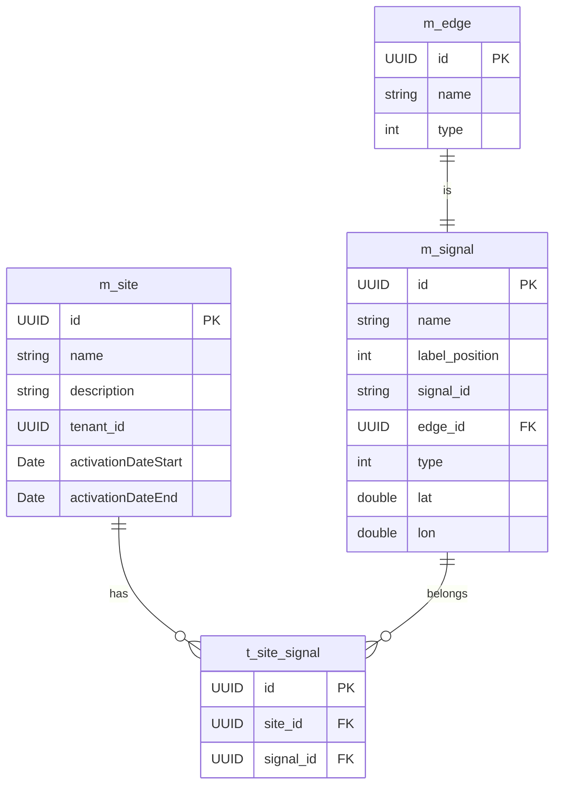

# Database Schema for Signal

## Overview
Design a database schema to manage **Signal** and its relationships with **Site** and **Edge**, where:
- A site can have multiple signals.
- A signal can belong to multiple sites.
- Each signal corresponds to exactly one edge.

Each signal originates from a JSON structure in the following format:

```json
{
    "type": "Feature",
    "geometry": {
        "type": "Point",
        "coordinates": [
            141.449467,
            43.178465
        ]
    },
    "properties": {
        "name": "道の駅とうべつ前北",
        "labelPosition": "top",
        "id": "1",
        "edgeId": "50f16642-5b0c-423e-b025-d929925aa5ad",
        "type": "two-color"
    }
}

```
Field descriptions:
- name: Display name string (表示名文字列)
- labelPosition: Position of the label. Possible values: top, bottom, left, right
- id: ID assigned to the signal during commissioning (not used on the screen)
- edgeId: Corresponds to the edge-uuid in topic {tenant-uuid}/{edge-uuid}/signal/info
- type: Signal type. Possible values: two-color, three-color
- coordinates: [longitude, latitude] values representing the geographic location of the signal

---
## ER Diagram

    Note: All tables will include the audit fields(`is_deleted`, `created_at`, `created_user_id`, `updated_at`,`updated_user_id`)


## SQL To Generate Table

- **SQL for Signal table**

```sql
    CREATE TABLE
        IF NOT EXISTS "<tenant_schema>".m_signal (
            id UUID NOT NULL,
            name VARCHAR(100),
            label_position INTEGER NOT NULL DEFAULT 0,
            signal_id VARCHAR(100),
            edge_id UUID,
            type INTEGER NOT NULL DEFAULT 0,
            lat DOUBLE PRECISION,
            lon DOUBLE PRECISION,
            is_deleted BOOLEAN DEFAULT FALSE,
            created_at TIMESTAMP NOT NULL,
            created_user_id UUID NOT NULL,
            updated_at TIMESTAMP NOT NULL,
            updated_user_id UUID NOT NULL,
            CONSTRAINT pk_m_signal PRIMARY KEY (id),
            CONSTRAINT fk_m_singal_edge FOREIGN KEY (edge_id) REFERENCES "<tenant_schema>".m_edge (id)
        );

    CREATE INDEX IF NOT EXISTS idx_m_signal_edge_id ON "<tenant_schema>".m_signal (edge_id);
    CREATE INDEX IF NOT EXISTS idx_m_signal_is_deleted ON "<tenant_schema>".m_signal (is_deleted);
    CREATE INDEX IF NOT EXISTS idx_m_signal_created_at ON "<tenant_schema>".m_signal (created_at);
    CREATE INDEX IF NOT EXISTS idx_m_signal_updated_at ON "<tenant_schema>".m_signal (updated_at);

    COMMENT ON TABLE "<tenant_schema>".m_signal IS 'Stores signal metadata including name, position, type, coordinates, and related edge';
    COMMENT ON COLUMN "<tenant_schema>".m_signal.id IS 'Primary key UUID for the signal';
    COMMENT ON COLUMN "<tenant_schema>".m_signal.name IS 'Signal name';
    COMMENT ON COLUMN "<tenant_schema>".m_signal.label_position IS 'Label position for the signal: top, bottom, left, or right';
    COMMENT ON COLUMN "<tenant_schema>".m_signal.signal_id IS 'ID assigned to the signal during commissioning (not used in UI)';
    COMMENT ON COLUMN "<tenant_schema>".m_signal.edge_id IS 'Foreign key reference to the m_edge table';
    COMMENT ON COLUMN "<tenant_schema>".m_signal.type IS 'Signal type indicator: two-color or three-color';
    COMMENT ON COLUMN "<tenant_schema>".m_signal.lat IS 'Latitude of the signal location';
    COMMENT ON COLUMN "<tenant_schema>".m_signal.lon IS 'Longitude of the signal location';
    COMMENT ON COLUMN "<tenant_schema>".m_signal.is_deleted IS 'Soft delete flag - true if record is deleted';
    COMMENT ON COLUMN "<tenant_schema>".m_signal.created_at IS 'Timestamp when the record was created';
    COMMENT ON COLUMN "<tenant_schema>".m_signal.created_user_id IS 'UUID of the user who created this record';
    COMMENT ON COLUMN "<tenant_schema>".m_signal.updated_at IS 'Timestamp when the record was last updated';
    COMMENT ON COLUMN "<tenant_schema>".m_signal.updated_user_id IS 'UUID of the user who last updated this record';

    CREATE TRIGGER trigger_m_signal_updated_at BEFORE
    UPDATE ON "<tenant_schema>".m_signal FOR EACH ROW EXECUTE FUNCTION update_updated_at_column ();  

```   

- **SQL for Site-Signal Relationship**

```sql
    CREATE TABLE
        IF NOT EXISTS "<tenant_schema>".t_site_signal (
            id UUID NOT NULL,
            site_id UUID NOT NULL,
            signal_id UUID NOT NULL,

            is_deleted BOOLEAN DEFAULT FALSE,
            created_at TIMESTAMP NOT NULL,
            created_user_id UUID NOT NULL,
            updated_at TIMESTAMP NOT NULL,
            updated_user_id UUID NOT NULL,

            CONSTRAINT pk_t_site_signal PRIMARY KEY (id),
            CONSTRAINT fk_t_site_signal_site FOREIGN KEY (site_id) REFERENCES "<tenant_schema>".m_site (id),
            CONSTRAINT fk_t_site_signal_signal FOREIGN KEY (signal_id) REFERENCES "<tenant_schema>".m_signal (id),
            CONSTRAINT uk_t_site_signal_site_signal UNIQUE (site_id, signal_id)
        );

    CREATE INDEX IF NOT EXISTS idx_t_site_signal_site_id ON "<tenant_schema>".t_site_signal (site_id);
    CREATE INDEX IF NOT EXISTS idx_t_site_signal_signal_id ON "<tenant_schema>".t_site_signal (signal_id);
    CREATE INDEX IF NOT EXISTS idx_t_site_signal_site_signal ON "<tenant_schema>".t_site_signal (site_id, signal_id);
    CREATE INDEX IF NOT EXISTS idx_t_site_signal_is_deleted ON "<tenant_schema>".t_site_signal (is_deleted);
    CREATE INDEX IF NOT EXISTS idx_t_site_signal_created_at ON "<tenant_schema>".t_site_signal (created_at);
    CREATE INDEX IF NOT EXISTS idx_t_site_signal_updated_at ON "<tenant_schema>".t_site_signal (updated_at);

    COMMENT ON TABLE "<tenant_schema>".t_site_signal IS 'Many-to-many relationship between sites and signals';
    COMMENT ON COLUMN "<tenant_schema>".t_site_signal.site_id IS 'Foreign key reference to m_site.id';
    COMMENT ON COLUMN "<tenant_schema>".t_site_signal.signal_id IS 'Foreign key reference to m_signal.id';
    COMMENT ON COLUMN "<tenant_schema>".t_site_signal.signal_id IS 'Foreign key reference to m_signal table';
    COMMENT ON COLUMN "<tenant_schema>".t_site_signal.is_deleted IS 'Soft delete flag - true if record is deleted';
    COMMENT ON COLUMN "<tenant_schema>".t_site_signal.created_at IS 'Timestamp when the record was created';
    COMMENT ON COLUMN "<tenant_schema>".t_site_signal.created_user_id IS 'UUID of the user who created this record';
    COMMENT ON COLUMN "<tenant_schema>".t_site_signal.updated_at IS 'Timestamp when the record was last updated';
    COMMENT ON COLUMN "<tenant_schema>".t_site_signal.updated_user_id IS 'UUID of the user who last updated this record';

    CREATE TRIGGER trigger_t_site_signal_updated_at BEFORE
    UPDATE ON "<tenant_schema>".t_site_signal FOR EACH ROW EXECUTE FUNCTION update_updated_at_column ()
    
```