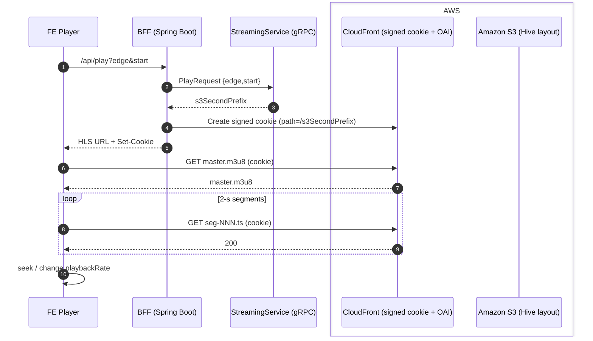
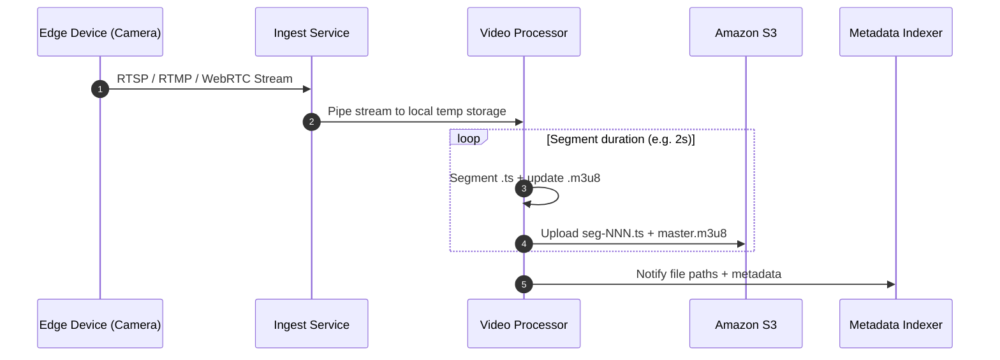

# Video Playback Logic Overview

A concise end‑to‑end flow for **live‑like video playback** in our multi‑tenant autonomous‑vehicle system, following the same layout as the IoT playback spec.

---

## Core Flow & Sequence

1. **Browser Request**

   - **FE Player** issues `GET /api/play?edge={edgeUuid}&start={ISO‑8601}`.

2. **Backend (Cookie)**

   - Sends `PlayRequest` to **StreamingService (gRPC)**.
   - StreamingService returns the **second‑level S3 prefix** for the timestamp.
   - BFF signs a **CloudFront cookie** limited to that prefix and returns the HLS URL + `Set‑Cookie` to the browser.

3. **Streaming via AWS**

   - **CloudFront** (OAI‑protected) serves `master.m3u8` and **N s segments** from **Amazon S3** (Hive layout down to `second=`).
   - FE Player buffers a few segments and starts instantly; seeking / playbackRate changes fetch the required segments on demand.

### Sequence Overview



---

## S3 Partition Layout

```plaintext
s3://<bucket>/data/
└── tenant_uuid=<tenant_uuid>/
    └── edge_uuid=<edge_uuid>/
        └── date=<YYYY-MM-DD>/
            └── hour=<HH>/
                └── minute=<mm>/
                    └── second=<ss>/
                        ├── master.m3u8
                        ├── v0/seg‑000.ts …
                        └── …
```

- **Segment granularity** — **N s HLS segments** with aligned key‑frames.
- **Second‑level folders** give precise cookie scoping and predictable cache keys.

## Recording And Convert to M3U8 File


